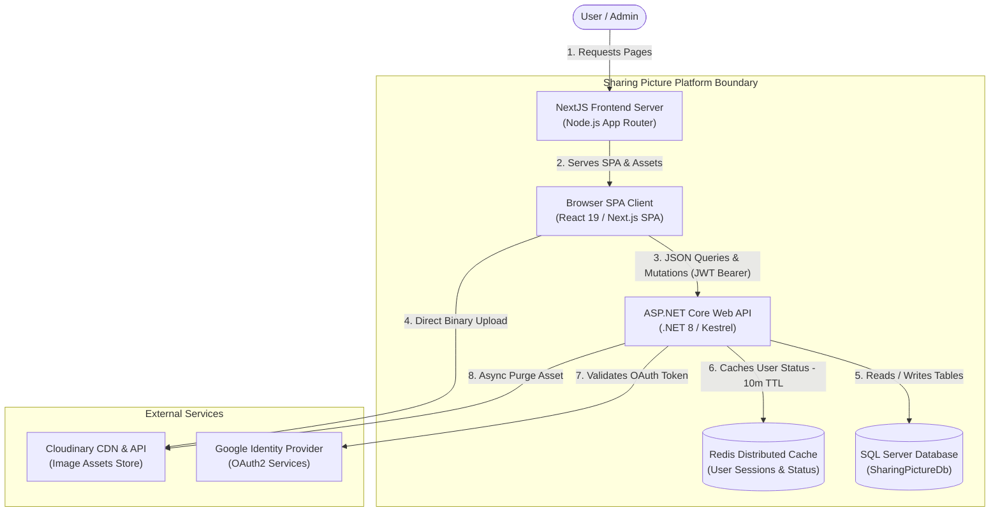

# Onboarding Document 2: Architecture and Database Reference

This document covers our decoupled system architecture, core design patterns, custom middleware pipelines, and a database schema quick-reference guide.

---

## 1. System Architecture Overview

Our platform uses a high-performance decoupled container layout designed to isolate frontend presentation logic from stateless, transaction-secure APIs, with a dedicated caching tier to reduce SQL loads.

### Architectural Boundaries & Structural Boundaries

*   **Decoupled Next.js Framework Treatment**: The frontend Next.js server serves initial static assets, prerendered layout envelopes, and React runtime code to the browser client. Once loaded, the Browser SPA Client takes over navigation and handles dynamic states, making async JSON API requests directly to the backend over HTTPS.
*   **Network Ingress Protection**: Public-facing requests are intercepted by a Reverse Proxy and Web Application Firewall (WAF) Ingress Gateway layer. This gateway terminates SSL, protects against common network vulnerabilities, and delegates traffic to local API controllers running within the high-throughput .NET Kestrel runner.
*   **In-Process Monolith DI Separations**: Inside the ASP.NET Core process, the codebase enforces strict separation of concerns. Controllers receive API payloads and delegate them to business services via Dependency Injection (DI) scopes. Services utilize Entity Framework Core DbContext configurations to query the underlying database.
*   **Anti-Thread Starvation Media Pipeline**: To keep backend CPU and memory footprints minimal, binary media uploads never traverse the .NET Web API process. The client browser uploads binary images directly to Cloudinary via HTTPS using secure SHA-256 API signatures generated in-process by the backend `MediaService`.
*   **Redis Distributed Caching Tier**: A Redis caching store acts as an intermediate state provider. For high-frequency middleware operations (e.g. validating user status on every request), user status is cached for 10 minutes, completely bypassing SQL Server on cache hits. On data modification (banning a user), the cache is explicitly evicted to maintain immediate authorization sync.

### Core Design Patterns Implemented

#### Repository & Unit of Work Pattern (via EF Core)
We rely on Entity Framework Core's `DbContext` ([SharingPictureDbContext.cs](file:///d:/Dev_Web/Picterest/backend/SharingPicture/SharingPicture.Data/Context/SharingPictureDbContext.cs)) as our central Repository and Unit of Work manager. DB connections, transaction cycles, and change trackers are abstracted by the DbContext interface.

#### Separation of Concerns Service Layer
Database operations and business rule validations are decoupled from API controllers. Controllers ([AuthController.cs](file:///d:/Dev_Web/Picterest/backend/SharingPicture/SharingPicture.WebApi/Controllers/AuthController.cs)) are strictly thin controllers responsible only for deserialization, ModelState checks, and returning IActionResult envelopes. Actual queries, validations, hashes, and updates live inside service classes like `AuthService`, `PostService`, and `ReportService`.

#### Dependency Injection (DI)
All services are registered inside the Web API Dependency Injection container scoped in [Program.cs](file:///d:/Dev_Web/Picterest/backend/SharingPicture/SharingPicture.WebApi/Program.cs). Services request their dependencies (e.g. DbContext or other services) via parameter list constructors, ensuring low coupling and testability.

#### Custom Middlewares
- **Active User Status Guard ([UserStatusValidationMiddleware.cs](file:///d:/Dev_Web/Picterest/backend/SharingPicture/SharingPicture.WebApi/Middleware/UserStatusValidationMiddleware.cs))**: Validates the active status of authenticated users on *every* request. If a user is deactivated or banned, the middleware bypasses subsequent routing and returns HTTP 401 Unauthorized immediately, invalidating any active JWTs.

---

## 2. Database Schema Reference

The SQL Server database is structured with the following normalized tables:

### Table Summary Reference

#### Table: `users`
Represents user credential accounts and profile indicators.
- `id` (int, PK, Identity): Primary key.
- `username` (varchar(50)): Unique username.
- `email` (varchar(100)): Unique email address.
- `password_hash` (varchar(255)): Salted password hash (BCrypt).
- `avatar_url` (varchar(255), nullable): Profile image URL.
- `status` (varchar(20), default `'active'`): Account state (`active`, `banned`, `deactivated`).
- `created_at` (datetime, default `GETDATE()`): Timestamp of signup.

#### Table: `roles`
System authorization roles.
- `id` (int, PK, Identity): Primary key.
- `role_name` (varchar(20)): Unique role string (`admin`, `moderator`, `user`).

#### Table: `user_roles`
Composite join table linking users to roles (Many-to-Many).
- `user_id` (int, FK pointing to `users(id)`): Join composite primary key.
- `role_id` (int, FK pointing to `roles(id)`): Join composite primary key.

#### Table: `posts`
Represents picture uploads metadata.
- `id` (int, PK, Identity): Primary key.
- `user_id` (int, FK pointing to `users(id)`): Creator reference.
- `caption` (nvarchar(1000), nullable): Post text content.
- `image_url` (varchar(255)): Cloudinary hosting URL.
- `cloudinary_public_id` (varchar(100)): Cloudinary asset ID.
- `delivery_status` (varchar(20), default `'pending'`): Visibility status (`pending`, `hidden`). Active visible statuses on the feed are evaluated via `.Where(p => p.DeliveryStatus != "hidden")`, which means statuses like `'pending'` or `'complete'` are valid public display states.
- `is_private` (bit, default `0`): Privacy visibility indicator.
- `created_at` (datetime, default `GETDATE()`): Timestamp of upload.

#### Table: `tags`
Categorization taxonomy.
- `id` (int, PK, Identity): Primary key.
- `tag_name` (nvarchar(50)): Unique normalized lowercase tag term.

#### Table: `post_tags`
Join table linking posts to tags (Many-to-Many).
- `post_id` (int, FK pointing to `posts(id)`): Join composite primary key.
- `tag_id` (int, FK pointing to `tags(id)`): Join composite primary key.

#### Table: `likes`
Join table mapping user engagement likes (Many-to-Many).
- `user_id` (int, FK pointing to `users(id)`): Composite primary key.
- `post_id` (int, FK pointing to `posts(id)`): Composite primary key.
- `created_at` (datetime, default `GETDATE()`): Timestamp of like.

#### Table: `comments`
Comments stream linked to posts.
- `id` (int, PK, Identity): Primary key.
- `user_id` (int, FK pointing to `users(id)`): Commenter reference.
- `post_id` (int, FK pointing to `posts(id)`): Target post reference.
- `content` (nvarchar(1000)): Plaintext message.
- `created_at` (datetime, default `GETDATE()`): Timestamp.

#### Table: `follows`
Social graph relations mapping user followers (Many-to-Many self-join).
- `follower_id` (int, FK pointing to `users(id)`): Composite primary key.
- `followed_id` (int, FK pointing to `users(id)`): Composite primary key.
- `created_at` (datetime, default `GETDATE()`): Timestamp.

#### Table: `reports`
User moderation complaints queue.
- `id` (int, PK, Identity): Primary key.
- `reporter_id` (int, FK pointing to `users(id)`): Reporting user reference.
- `post_id` (int, FK pointing to `posts(id)`): Reported post.
- `reason` (nvarchar(1000)): Complaint comment.
- `status` (varchar(20), default `'pending'`): Report status (`pending`, `resolved`, `dismissed`).
- `moderator_id` (int, FK pointing to `users(id)`, nullable): Moderator processing resolution.
- `created_at` (datetime, default `GETDATE()`): Timestamp.

#### Table: `audit_logs`
Central log history for administrative actions.
- `id` (int, PK, Identity): Primary key.
- `action` (varchar(50)): Event descriptor (`DELETE_POST`, `BAN_USER`, `DISMISS_REPORT`).
- `actor_id` (int, FK pointing to `users(id)`, nullable): Admin/Moderator user ID.
- `target_id` (int, nullable): Infraction target ID.
- `details` (varchar(1000)): Contextual log notes.
- `created_at` (datetime, default `GETDATE()`): Timestamp.

---

## 3. Data Integrity & Cascading Constraints

To protect data consistency and comply with SQL Server constraints, the platform handles CASCADE operations programmatically:
1. **Direct Constraints**: Relational foreign keys are mapped using database integrity rules.
2. **Programmatic Cascades & Eventual Consistency**: Direct SQL CASCADE deletes on complex entities (like User or Post) can cause circular dependency constraints in SQL Server. Thus, controllers and services execute programmatic cascades. For example, during `DELETE_POST` resolution in `AdminService`:
   - A database transaction block is opened: `await _context.Database.BeginTransactionAsync()`.
   - Programmatic database removals are performed sequentially (Comments -> Likes -> Reports -> Post) and logged to the central audit log.
   - The database changes are saved and the transaction is committed: `await _context.SaveChangesAsync()` followed by `await transaction.CommitAsync()`.
   - **Async Cloudinary Purge**: Only after the SQL transaction successfully commits, the system dispatches the Cloudinary asset destruction call asynchronously via `MediaService.DeleteImageAsync(cloudinary_public_id)` inside a background thread (`Task.Run`). This eventual consistency pattern ensures that database transaction rollbacks never trigger premature external asset deletions, avoiding distributed data inconsistencies.
3. **Validation Guards**: Entity uniqueness is validated (e.g. unique username checks in [ProfileService.cs](file:///d:/Dev_Web/Picterest/backend/SharingPicture/SharingPicture.Services/ProfileService.cs) and unique report checks in [ReportService.cs](file:///d:/Dev_Web/Picterest/backend/SharingPicture/SharingPicture.Services/ReportService.cs)) prior to database save operations.
