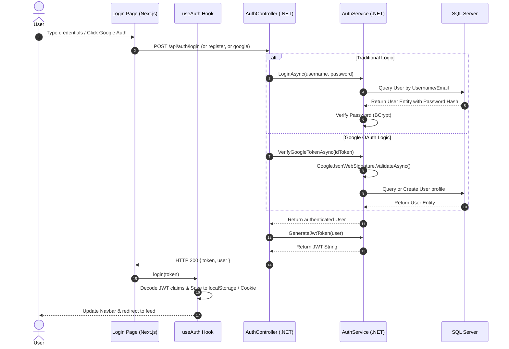
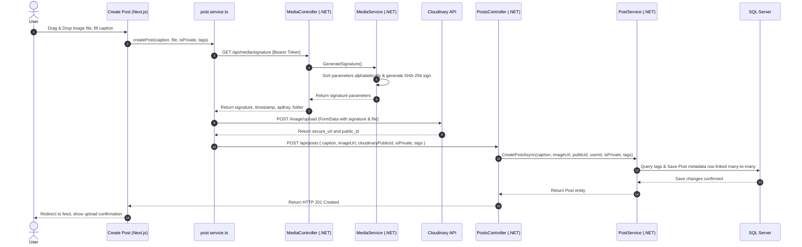
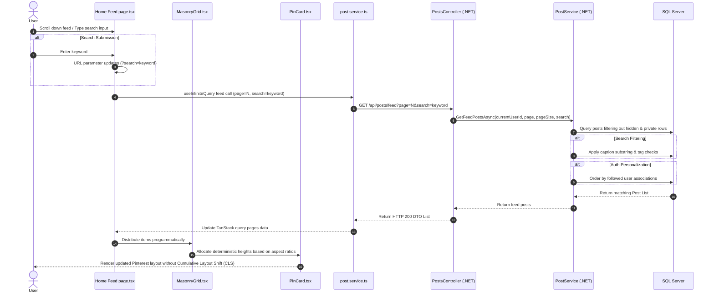
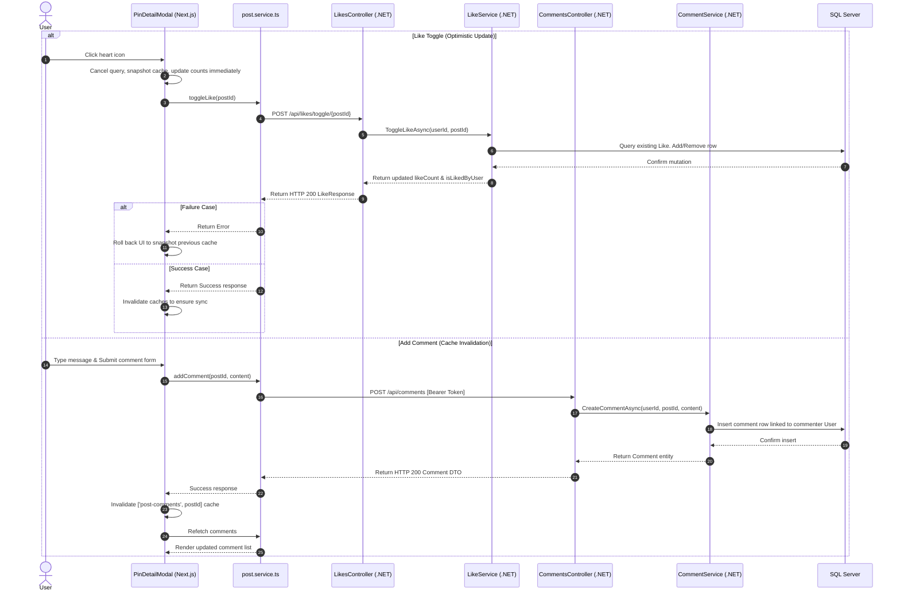
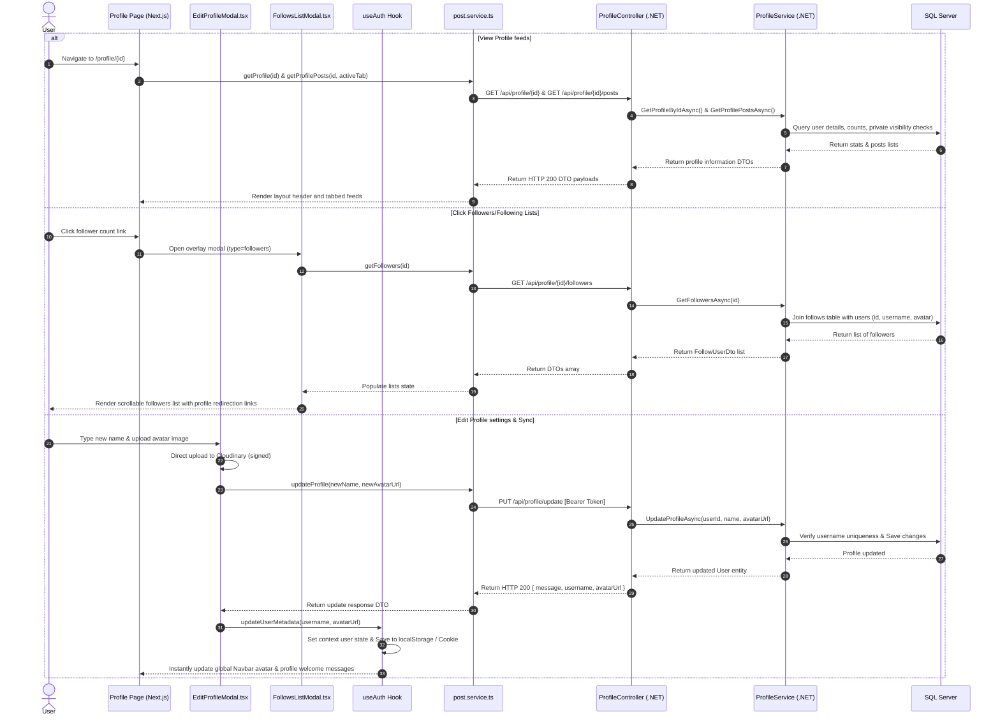
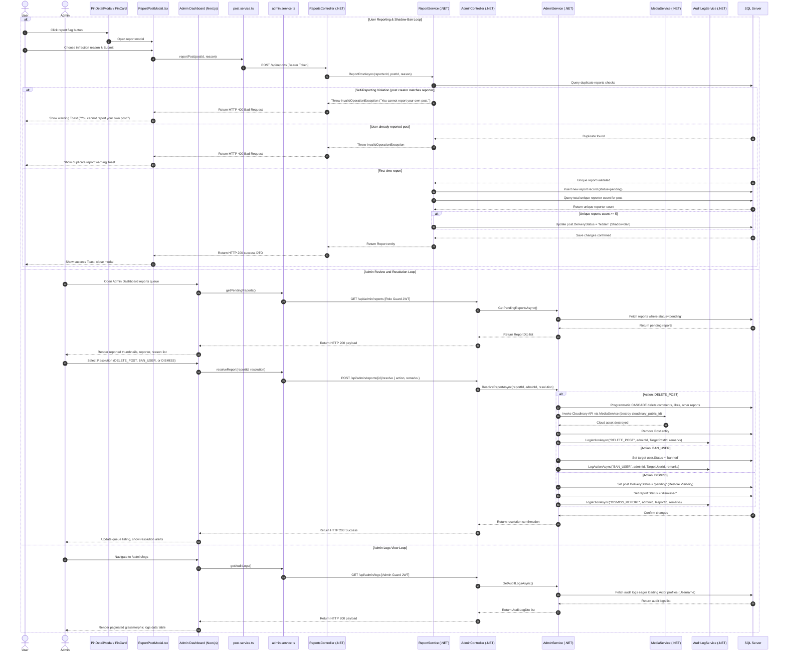

# Onboarding Document 3: Features and Code Mappings

This document covers our 6 core use cases. For each feature, we detail its operational scope, data flow diagrams, mappings of code files, and deep-dive technical explanations.

---

## Use Case A: User Authentication & Google OAuth Login

### 1. Narrative Description
This feature allows users to sign up or log in using traditional credentials (username, email, password) or dynamically authenticate using a Google account. Password hashing is enforced using BCrypt. JWT authentication is used for session preservation, and custom middleware guards endpoints against banned accounts.

### 2. Mermaid Sequence Diagram

### 3. Explicit Code File Mapping Table
| Layer/Side | File Path | Technical Role & Responsibility in the Flow |
| :--- | :--- | :--- |
| Frontend | [page.tsx](file:///d:/Dev_Web/Picterest/frontend/src/app/(auth)/login/page.tsx) | Renders the Auth card layout and dispatches credentials / ID tokens payload. |
| Frontend | [useAuth.tsx](file:///d:/Dev_Web/Picterest/frontend/src/hooks/useAuth.tsx) | Auth state manager. Decodes JWT claims, manages localStorage/cookies state, and provides `login/logout` actions. |
| Backend API | [AuthController.cs](file:///d:/Dev_Web/Picterest/backend/SharingPicture/SharingPicture.WebApi/Controllers/AuthController.cs) | Thin API controller parsing request bodies, running Model validation, and returning JSON tokens. |
| Backend Services | [AuthService.cs](file:///d:/Dev_Web/Picterest/backend/SharingPicture/SharingPicture.Services/AuthService.cs) | Drives BCrypt hashing, executes Google Identity signature checks, and generates signed JWT payloads. |
| Backend Data | [User.cs](file:///d:/Dev_Web/Picterest/backend/SharingPicture/SharingPicture.Data/Entities/User.cs) | Data entity model mapping properties to the `users` table. |

### 4. End-to-End Data Flow Explanation
When logging in, credentials flow from [page.tsx](file:///d:/Dev_Web/Picterest/frontend/src/app/(auth)/login/page.tsx) in an HTTP POST body. The Web API parses this into a request model, validates formatting constraints, and invokes `AuthService`. The database is queried to extract password hashes, which are verified via BCrypt. If successful, the server generates a symmetric HMAC-SHA256 signed JWT containing ID, username, and role claims. On receipt, the client stores this token in localStorage and cookies. The [useAuth.tsx](file:///d:/Dev_Web/Picterest/frontend/src/hooks/useAuth.tsx) hook decodes the token parameters, stores them in state, and sets context indicators (`isAuthenticated = true`), updating layout elements across the app.

---

## Use Case B: Secure Direct Image Upload to Cloudinary via .NET Digital Signature

### 1. Narrative Description
Instead of routing large file uploads through the .NET server, the client uploads assets directly to Cloudinary. To secure the upload preset, the client requests a secure digital signature from the backend. The backend signs parameters with SHA-256 using its Cloudinary API secret.

### 2. Mermaid Sequence Diagram

### 3. Explicit Code File Mapping Table
| Layer/Side | File Path | Technical Role & Responsibility in the Flow |
| :--- | :--- | :--- |
| Frontend | [page.tsx](file:///d:/Dev_Web/Picterest/frontend/src/app/posts/create/page.tsx) | Upload form layout. Drives drag-and-drop actions, previews, and tag parsing. |
| Frontend | [post.service.ts](file:///d:/Dev_Web/Picterest/frontend/src/services/post.service.ts) | Coordinates the three-step upload process and dispatches files/signatures. |
| Backend API | [MediaController.cs](file:///d:/Dev_Web/Picterest/backend/SharingPicture/SharingPicture.WebApi/Controllers/MediaController.cs) | Exposes GET signature endpoints under `[Authorize]` attributes. |
| Backend API | [PostsController.cs](file:///d:/Dev_Web/Picterest/backend/SharingPicture/SharingPicture.WebApi/Controllers/PostsController.cs) | Exposes POST posts creation endpoints under `[Authorize]` attributes. |
| Backend Services | [MediaService.cs](file:///d:/Dev_Web/Picterest/backend/SharingPicture/SharingPicture.Services/MediaService.cs) | Generates secure digital sign templates sorting parameters alphabetically. |
| Backend Services | [PostService.cs](file:///d:/Dev_Web/Picterest/backend/SharingPicture/SharingPicture.Services/PostService.cs) | Normalizes tag arrays, links many-to-many entities, and inserts SQL metadata records. |

### 4. End-to-End Data Flow Explanation
The upload starts in [page.tsx](file:///d:/Dev_Web/Picterest/frontend/src/app/posts/create/page.tsx) when selecting a file. The helper in [post.service.ts](file:///d:/Dev_Web/Picterest/frontend/src/services/post.service.ts) requests signature parameters from the API. The API service validates authentication claims, prepares metadata parameters (timestamp, upload_preset, folder), sorts them alphabetically, and hashes them with the private API secret. The client receives these parameters and sends a `multipart/form-data` request directly to Cloudinary. Cloudinary validates the signature and returns the hosted image URL and public ID. The client then sends this hosted metadata back to the backend, which parses the tags, links them, and stores the post record in the database.

---

## Use Case C: Infinite Scroll Masonry Feed with Anti-CLS and Search Parameter Filtering

### 1. Narrative Description
Guests and authenticated users browse posts in a responsive, multi-column grid feed. Columns are calculated programmatically to avoid layout shifts. The feed supports search query filters and prioritizes content from users that the logged-in user follows.

### 2. Mermaid Sequence Diagram

### 3. Explicit Code File Mapping Table
| Layer/Side | File Path | Technical Role & Responsibility in the Flow |
| :--- | :--- | :--- |
| Frontend | [page.tsx](file:///d:/Dev_Web/Picterest/frontend/src/app/page.tsx) | Home page feed wrapper driving infinite scroll sentinel query actions. |
| Frontend | [Navbar.tsx](file:///d:/Dev_Web/Picterest/frontend/src/components/pinterest/Navbar.tsx) | Exposes search input routing search terms non-destructively. |
| Frontend | [MasonryGrid.tsx](file:///d:/Dev_Web/Picterest/frontend/src/components/pinterest/MasonryGrid.tsx) | Maps grid columns to distribute feed posts sequentially. |
| Frontend | [PinCard.tsx](file:///d:/Dev_Web/Picterest/frontend/src/components/pinterest/PinCard.tsx) | Renders post previews using deterministic aspect ratio calculations to avoid layout shift. |
| Backend API | [PostsController.cs](file:///d:/Dev_Web/Picterest/backend/SharingPicture/SharingPicture.WebApi/Controllers/PostsController.cs) | Exposes feed queries mapping search parameter inputs. |
| Backend Services | [PostService.cs](file:///d:/Dev_Web/Picterest/backend/SharingPicture/SharingPicture.Services/PostService.cs) | Applies search parameter conditions and follow-prioritization logic to the database query. |

### 4. End-to-End Data Flow Explanation
As the user scrolls, an intersection sentinel in [page.tsx](file:///d:/Dev_Web/Picterest/frontend/src/app/page.tsx) triggers a new page fetch using TanStack Query. The query fetches `GET /api/posts/feed?page=N` via [post.service.ts](file:///d:/Dev_Web/Picterest/frontend/src/services/post.service.ts). The backend parses parameter arguments (including current user credentials, search queries, and pagination details). The LINQ query filters out private or hidden posts, joins relation states (likes, creator profile), and executes caption/tag substring matching. If authenticated, followed users' posts are prioritized via `OrderByDescending` sorting logic. The returned items are distributed across columns dynamically by `MasonryGrid` using deterministic aspect ratios.

> [!WARNING]
> **Warning on Non-Destructive URL Parameter Mutations (Search & Modal Sync)**:
> When opening or closing the post detail modal (by appending or dropping the `postId` query parameter), the routing logic must mutate the query string **non-destructively**. You must clone the current parameters via `URLSearchParams` and only set/delete the `postId` key while preserving all other keys (like `search`). Doing otherwise (e.g., wiping out existing parameters) will discard the active search term, breaking the Navbar search input state synchronization and unexpectedly clearing the user's active search filter.

---

## Use Case D: Social Interactions (Optimistic Like Toggles & Real-Time Comment Invalidation)

### 1. Narrative Description
Users interact with posts by liking them or commenting. Clicking the like button updates the UI immediately, rolling back changes if the backend request fails. Adding a comment updates the thread list by invalidating the cache.

### 2. Mermaid Sequence Diagram

### 3. Explicit Code File Mapping Table
| Layer/Side | File Path | Technical Role & Responsibility in the Flow |
| :--- | :--- | :--- |
| Frontend | [PinCard.tsx](file:///d:/Dev_Web/Picterest/frontend/src/components/pinterest/PinCard.tsx) | Hosts optimistic like mutations for the home feed view cards. |
| Frontend | [PinDetailModal.tsx](file:///d:/Dev_Web/Picterest/frontend/src/components/pinterest/PinDetailModal.tsx) | Contains like and comment mutation forms driving cache invalidations. |
| Frontend | [post.service.ts](file:///d:/Dev_Web/Picterest/frontend/src/services/post.service.ts) | Houses client fetches and DTO definitions for likes and comments. |
| Backend API | [LikesController.cs](file:///d:/Dev_Web/Picterest/backend/SharingPicture/SharingPicture.WebApi/Controllers/LikesController.cs) | Exposes protected likes toggle routes. |
| Backend API | [CommentsController.cs](file:///d:/Dev_Web/Picterest/backend/SharingPicture/SharingPicture.WebApi/Controllers/CommentsController.cs) | Exposes comments list retrieval and comment creation routes. |
| Backend Services | [LikeService.cs](file:///d:/Dev_Web/Picterest/backend/SharingPicture/SharingPicture.Services/LikeService.cs) | Toggles user like states and returns updated like counts. |
| Backend Services | [CommentService.cs](file:///d:/Dev_Web/Picterest/backend/SharingPicture/SharingPicture.Services/CommentService.cs) | Creates and returns comments, query-joining user metadata. |

### 4. End-to-End Data Flow Explanation
Like toggling is driven by TanStack Query's `onMutate` handler. When the user clicks the like icon, outgoing queries are cancelled, current feed states are snapshotted, and counts/like flags are modified immediately. The API request is dispatched to the backend. `LikeService` searches for a matching user-post row in the `likes` table. If found, the row is removed; otherwise, a new like is inserted. The backend returns the updated totals. If the request fails, `onError` restores the UI to the cached snapshot. Comment creation follows a standard mutation flow: after the backend inserts the comment row, the client invalidates the `['post-comments']` query cache, forcing an asynchronous refetch to keep the comments stream updated.

> [!WARNING]
> **Warning on Non-Destructive URL Parameter Mutations**:
> Similar to Use Case C, when user interactions trigger updates that touch URL routes or modal open/close states (such as clicking on cards from search results), the route pushes must preserve the current query parameters. Failing to clone current query parameters before appending `postId` will disrupt active search filters and sever search parameter bindings in the global Navigation Bar.

---

## Use Case E: User Profile Views with Interactive Followers/Following Lists and Meta State Sync

### 1. Narrative Description
Users browse profiles to view metadata statistics, follower counts, created/liked feeds, and follower lists. Modifying profile settings updates the username and avatar URL, updating layout welcome messages and the global navigation bar in real-time.

### 2. Mermaid Sequence Diagram

### 3. Explicit Code File Mapping Table
| Layer/Side | File Path | Technical Role & Responsibility in the Flow |
| :--- | :--- | :--- |
| Frontend | [page.tsx](file:///d:/Dev_Web/Picterest/frontend/src/app/profile/%5Bid%5D/page.tsx) | Profile page routing layout. Manages follow mutations, tab states, and grid swaps. |
| Frontend | [EditProfileModal.tsx](file:///d:/Dev_Web/Picterest/frontend/src/components/pinterest/EditProfileModal.tsx) | Profile editor modal. Manages Cloudinary avatar uploads and saves profile changes. |
| Frontend | [FollowsListModal.tsx](file:///d:/Dev_Web/Picterest/frontend/src/components/pinterest/FollowsListModal.tsx) | Modal displaying followers/following lists using Next.js route navigation links. |
| Frontend | [Navbar.tsx](file:///d:/Dev_Web/Picterest/frontend/src/components/pinterest/Navbar.tsx) | Listens to `useAuth` hook user state, updating display avatar. |
| Frontend | [useAuth.tsx](file:///d:/Dev_Web/Picterest/frontend/src/hooks/useAuth.tsx) | Holds `updateUserMetadata` context actions to update cached user overrides. |
| Frontend | [post.service.ts](file:///d:/Dev_Web/Picterest/frontend/src/services/post.service.ts) | Client fetch APIs: profiles, posts, following lists, and metadata updates. |
| Backend API | [ProfileController.cs](file:///d:/Dev_Web/Picterest/backend/SharingPicture/SharingPicture.WebApi/Controllers/ProfileController.cs) | Exposes endpoints to query profiles, posts, followers/following lists, and save updates. |
| Backend Services | [ProfileService.cs](file:///d:/Dev_Web/Picterest/backend/SharingPicture/SharingPicture.Services/ProfileService.cs) | Queries profile stats, follower/following lists, and validates username uniqueness during profile updates. |

### 4. End-to-End Data Flow Explanation
Navigating to a profile page queries `GetProfileByIdAsync` to return counts and details. Submitting a settings update first uploads the image to Cloudinary, then sends a PUT request containing the username and image URL. `ProfileService` validates that the display name is unique. Once approved and saved, the updated user details are returned to [EditProfileModal.tsx](file:///d:/Dev_Web/Picterest/frontend/src/components/pinterest/EditProfileModal.tsx), which passes them to `updateUserMetadata`. This function merges the overrides with the global state, saving the updated user to `localStorage` and a cookie named `user`. During page loads, the initial auth checks check for cached overrides to keep layout welcome panels and the global navbar avatar updated in real-time.

---

## Use Case F: User Reporting Shadow-Ban Automation & Admin Moderation Panel with Audit Logging

### 1. Narrative Description
Users can report content that violates community guidelines. If a post receives 5 or more unique user reports, it is automatically shadow-banned (its `DeliveryStatus` is set to `"hidden"`, removing it from the public feed). To prevent self-reporting loop abuse, a strict self-reporting constraint is enforced: a user is prohibited from reporting their own post. This rule is validated on the backend and the report trigger is hidden from the UI when a post belongs to the authenticated user. Admins review reported posts and can either delete them (using programmatic cascade deletes), ban users, or dismiss reports (restoring the post's status back to `"pending"`). All admin resolutions are logged to the database. Administrators can access the Admin Audit Logs UI Dashboard to monitor administrative actions, actor profiles, target IDs, and remarks.

### 2. Mermaid Sequence Diagram

### 3. Explicit Code File Mapping Table
| Layer/Side | File Path | Technical Role & Responsibility in the Flow |
| :--- | :--- | :--- |
| Frontend | [ReportPostModal.tsx](file:///d:/Dev_Web/Picterest/frontend/src/components/pinterest/ReportPostModal.tsx) | Renders report forms inside React Portal (`createPortal`), handles select dropdowns, custom textarea, and toast alerts. |
| Frontend | [page.tsx](file:///d:/Dev_Web/Picterest/frontend/src/app/admin/reports/page.tsx) | Admin reports dashboard. Lists reports and allows admins to resolve them. |
| Frontend | [page.tsx](file:///d:/Dev_Web/Picterest/frontend/src/app/admin/logs/page.tsx) | Admin audit logs dashboard. Renders paginated table of administrative audit logs history. |
| Frontend | [admin.service.ts](file:///d:/Dev_Web/Picterest/frontend/src/services/admin.service.ts) | Exposes client-side routes to get reports queue list, dispatch resolutions, and fetch audit logs. |
| Backend API | [ReportsController.cs](file:///d:/Dev_Web/Picterest/backend/SharingPicture/SharingPicture.WebApi/Controllers/ReportsController.cs) | Exposes the protected `POST /api/reports` endpoint. |
| Backend API | [AdminController.cs](file:///d:/Dev_Web/Picterest/backend/SharingPicture/SharingPicture.WebApi/Controllers/AdminController.cs) | Exposes protected admin reports queries, report resolutions, and the audit logs list endpoints. |
| Backend Services | [ReportService.cs](file:///d:/Dev_Web/Picterest/backend/SharingPicture/SharingPicture.Services/ReportService.cs) | Validates reporter details to reject self-reporting and duplicate submissions, and handles shadow-ban automated hiding. |
| Backend Services | [AdminService.cs](file:///d:/Dev_Web/Picterest/backend/SharingPicture/SharingPicture.Services/AdminService.cs) | Executes administrative resolutions, cascades deletions, updates user/post states, and queries paginated audit logs. |
| Backend Services | [AuditLogService.cs](file:///d:/Dev_Web/Picterest/backend/SharingPicture/SharingPicture.Services/AuditLogService.cs) | Logs administrative actions to the central `audit_logs` database table. |

### 4. End-to-End Data Flow Explanation
When a report is submitted, the request goes to `ReportPostAsync`. The service checks the `reports` table to verify the user has not reported this post yet, and rejects self-reports (where post owner matches reporter). If a duplicate or self-report is found, an exception is thrown, returning an HTTP 400 Bad Request to the client, which displays a warning toast. If validation passes, a new report row is added. The service then queries the unique report count for the post. If the count reaches 5 or more, the post's `DeliveryStatus` is set to `"hidden"`. When an admin reviews the reports queue and selects a resolution:
- **`DELETE_POST`**: The system cascades database deletion down to the post's comments, likes, and reports. **IMPORTANT**: To prevent storage leaks in our cloud hosting, the system must explicitly invoke the Cloudinary API via `MediaService` (using `cloudinary_public_id`) to destroy the hosted cloud asset *before* the SQL database removes the actual post record.
- **`BAN_USER`**: Sets the user's status to `"banned"`, which is checked by middleware.
- **`DISMISS`**: Sets `DeliveryStatus` back to `"pending"`, restoring the post's visibility.
All moderator actions are logged to the `audit_logs` database table.

> [!NOTE]
> **React Portal Viewport Breakthrough**:
> The `ReportPostModal.tsx` component is wrapped with React's `createPortal` targeting `document.body`. This forces the modal layout to render outside the DOM hierarchy of parent elements (like `PinCard` or other grid blocks). It prevents CSS constraints like parent transforms (used for feed hover translations) or container `overflow: hidden` rules from clipping, scaling, or trapping the glassmorphic overlay, guaranteeing absolute z-index viewport positioning.

