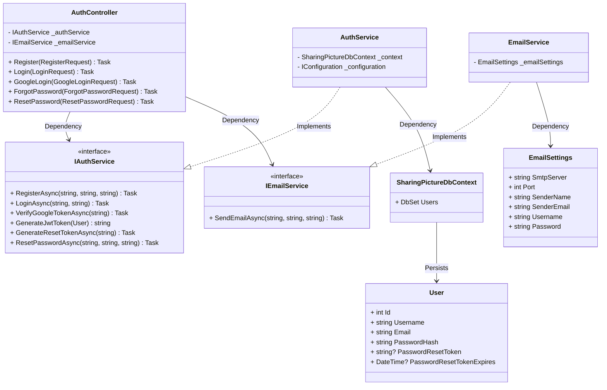
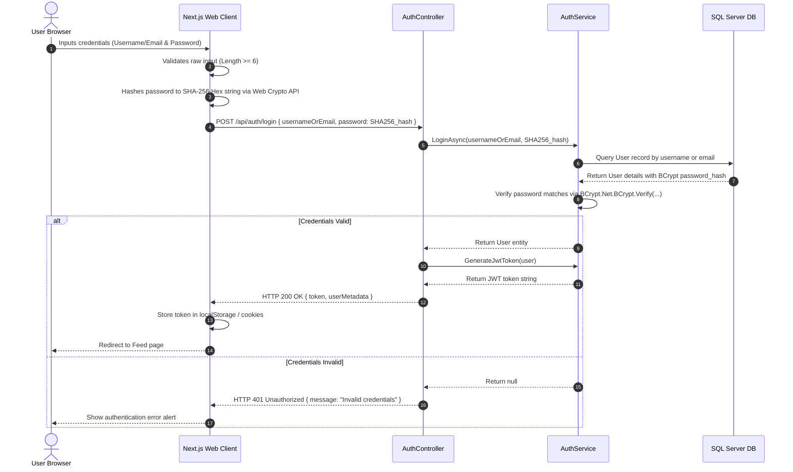
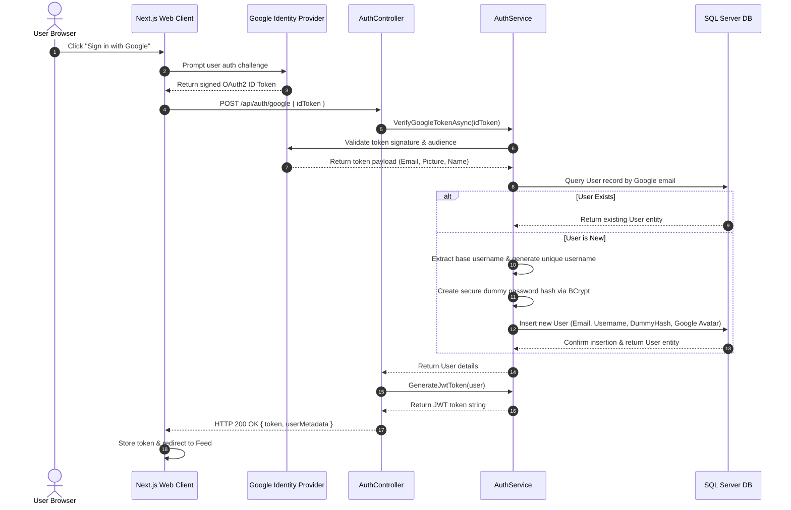
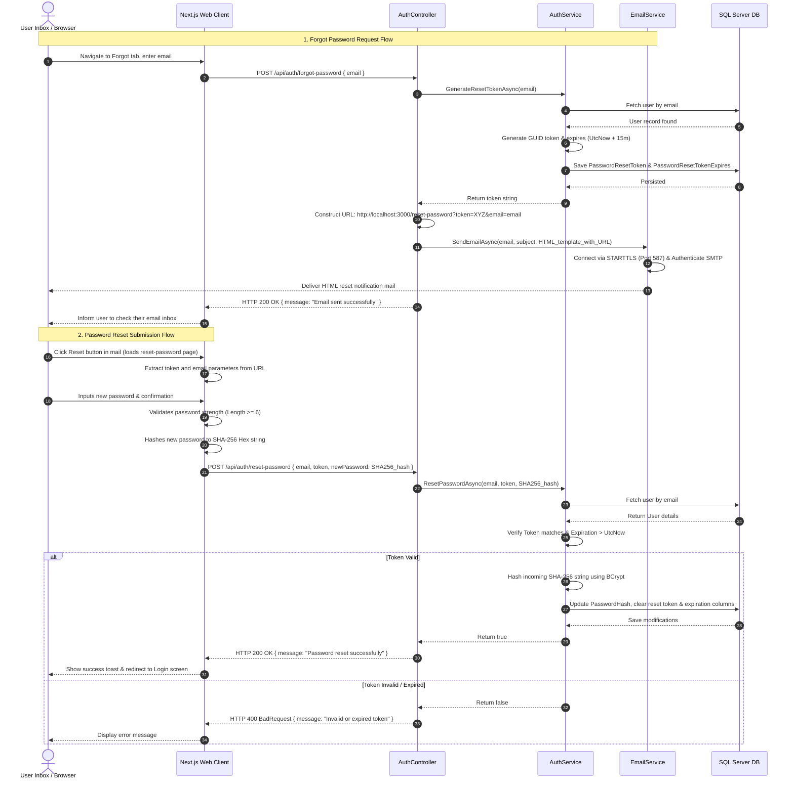

# Authentication, Authorization & Password Reset Flows

This document details the architectural structure, class designs, sequence flows, and codebase mappings for authentication, Google OAuth login, and the forgot/reset password system.

---

## 1. Class Diagram

The class diagram below displays the structural relationships and dependencies between controllers, services, database contexts, and models in the authentication module.

---

## 2. Sequence Diagrams

### Use Case 1: Login with Account (Traditional Login)
This diagram illustrates traditional credentials verification using client-side pre-hashing and server-side BCrypt validation.

### Use Case 2: Login with Google (OAuth2)
This flow models external single-sign-on token verification, auto-registering new OAuth accounts on-the-fly.

### Use Case 3: Forgot & Reset Password
This sequence maps the request of a reset token (which sends a real HTML email via MailKit SMTP) and the subsequent password reset submission.

---

## 3. Codebase File References

These are the primary source code implementation mappings representing these security architectures:

### Client Interface (Next.js)
- [login/page.tsx](file:///d:/Dev_Web/Picterest/frontend/src/app/(auth)/login/page.tsx): Controls the login and registration switch forms, handles validation, SHA-256 pre-hashing, Google OAuth payload submissions, and Forgot Password email requests.
- [reset-password/page.tsx](file:///d:/Dev_Web/Picterest/frontend/src/app/(auth)/reset-password/page.tsx): Reads parameter tokens from URL queries, executes validation, handles SubtleCrypto SHA-256 password pre-hashing, and submits password reset queries.
- [useAuth.tsx](file:///d:/Dev_Web/Picterest/frontend/src/hooks/useAuth.tsx): Stores active tokens, handles JSON Web Token payload decoding, and provides session state values globally.

### Presentation API Layer (ASP.NET Controllers)
- [AuthController.cs](file:///d:/Dev_Web/Picterest/backend/SharingPicture/SharingPicture.WebApi/Controllers/AuthController.cs): Receives HTTP payloads, validates DTO inputs, injects authorization handlers, maps login profiles, handles Google SSO callbacks, sends SMTP emails, and executes password updates.

### Business & Configuration Layer (C# Services)
- [IAuthService.cs](file:///d:/Dev_Web/Picterest/backend/SharingPicture/SharingPicture.Services/IAuthService.cs): Defines the core interface contracts for registration, authentication, OAuth validation, and token updates.
- [AuthService.cs](file:///d:/Dev_Web/Picterest/backend/SharingPicture/SharingPicture.Services/AuthService.cs): Holds business logic, verifies security states, generates JWT authorization tokens, hashes incoming passwords using BCrypt, and updates reset credentials.
- [IEmailService.cs](file:///d:/Dev_Web/Picterest/backend/SharingPicture/SharingPicture.Services/IEmailService.cs): Defines the SMTP email delivery contracts.
- [EmailService.cs](file:///d:/Dev_Web/Picterest/backend/SharingPicture/SharingPicture.Services/EmailService.cs): Connects to Brevo SMTP servers using STARTTLS security protocols via MailKit, delivering HTML templates.
- [EmailSettings.cs](file:///d:/Dev_Web/Picterest/backend/SharingPicture/SharingPicture.Services/EmailSettings.cs): Maps the SMTP configuration options.

### Persistent Entity Model
- [SharingPictureDbContext.cs](file:///d:/Dev_Web/Picterest/backend/SharingPicture/SharingPicture.Data/Context/SharingPictureDbContext.cs): EF Core context binding mapping.
- [User.cs](file:///d:/Dev_Web/Picterest/backend/SharingPicture/SharingPicture.Data/Entities/User.cs): User table metadata fields mapping.
